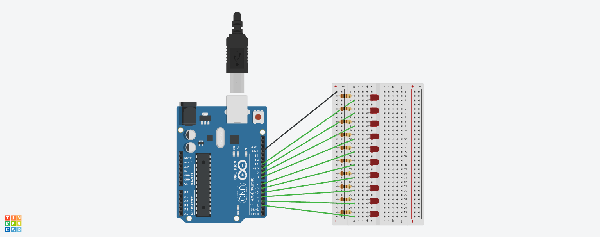

# Отчет №10
## Илья Герасимов
### Группа 8310

[Ссылка на проект 10](https://www.tinkercad.com/things/0B6YMWxa8bG)


## Листинг программы 10.1
```C++
byte i;
byte LedMin = 2;
byte LedMax = 11;
void setup()
{
  for (i = LedMin; i < LedMax; i++)
  {
    pinMode(i, OUTPUT);
  }
}
void loop()
{
  for (i = LedMin; i <= LedMax; i++)
  {
    digitalWrite(i, HIGH);
    delay(500);
  }
  for(i = LedMax; i >= LedMin; i--)
  {
    digitalWrite(i, LOW);
    delay(500);
  }
}
```

## Листинг программы 10.2
```C++
byte i;
byte LedMin = 2;
byte LedMax = 11;
void setup()
{
  for (i = LedMin; i < LedMax; i++)
  {
    pinMode(i, OUTPUT);
  }
}
void loop()
{
  for (i = LedMin; i <= LedMax; i++)
  {
    digitalWrite(i, HIGH);
    delay(500);
  }
  for(i = LedMin; i <= LedMax; i++)
  {
    digitalWrite(i, LOW);
    delay(500);
  }
}
```
[Ссылка на проект 10.3](https://www.tinkercad.com/things/lFchsZXNepG)
## Листинг программы 10.3
```C++
byte i;
byte LedMin = 1;
byte LedMax = 11;
void setup()
{
  for (i = LedMin; i < LedMax; i++)
  {
    pinMode(i, OUTPUT);
  }
}
void loop()
{
  for (i = LedMin; i <= LedMax; i++)
  {
    digitalWrite(i, HIGH);
    delay(500);
  }
  for(i = LedMax; i >= LedMin; i--)
  {
    digitalWrite(i, LOW);
    delay(500);
  }
}
```
[Ссылка на проект 10.4](https://www.tinkercad.com/things/k8tjRHI9PCS)
## Листинг программы 10.4
```C++
byte i;
byte LedMin = 2;
byte LedMax = 11;
void setup()
{
  for (i = LedMin; i < LedMax; i++)
  {
    pinMode(i, OUTPUT);
  }
}
void loop()
{
  for (i = LedMin; i <= LedMax; i = i+2)
  {
    digitalWrite(i, HIGH);
    delay(500);
  }
  for(i = LedMax; i >= LedMin; i--)
  {
    digitalWrite(i, LOW);
    delay(500);
  }
}
```
[Ссылка на проект 10.5](https://www.tinkercad.com/things/1w5x1s4Wrob)
## Листинг программы 10.5
```C++
byte i;
byte LedMin = 2;
byte LedMax = 6;
void setup()
{
  for (i = LedMin; i < LedMax; i++)
  {
    pinMode(i, OUTPUT);
  }
}
void loop()
{
  for (i = LedMin; i <= LedMax; i++)
  {
    digitalWrite(i, HIGH);
    delay(500);
  }
  for(i = LedMin; i <= LedMax; i++)
  {
    digitalWrite(i, LOW);
    delay(500);
  }
}
```
## Листинг программы 10.6
```C++
byte i;
byte LedMin = 2;
byte LedMax = 6;
void setup()
{
  for (i = LedMin; i < LedMax; i++)
  {
    pinMode(i, OUTPUT);
  }
}
void loop()
{
  for (i = LedMin; i <= LedMax; i++)
  {
    digitalWrite(i, HIGH);
    delay(500);
  }
  for(i = LedMax; i >= LedMin; i--)
  {
    digitalWrite(i, LOW);
    delay(500);
  }
}
```