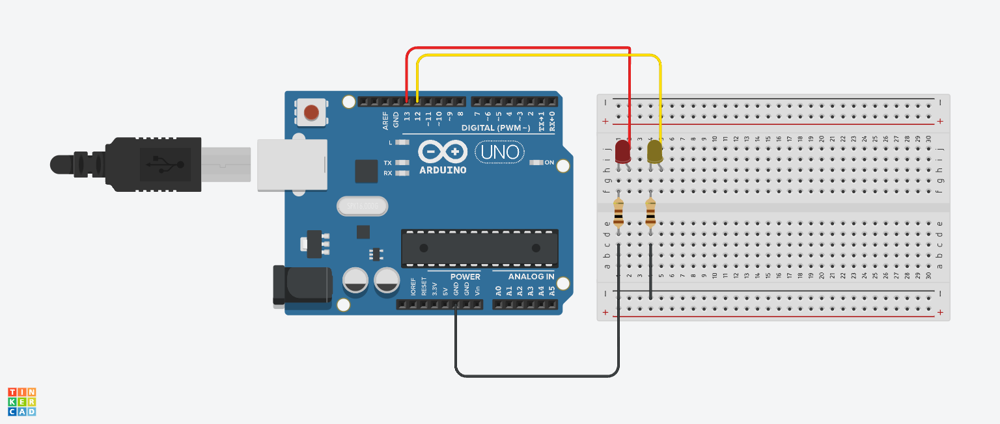
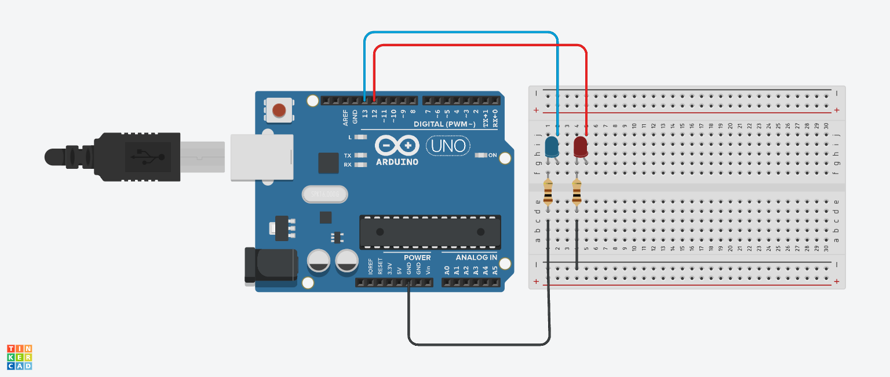
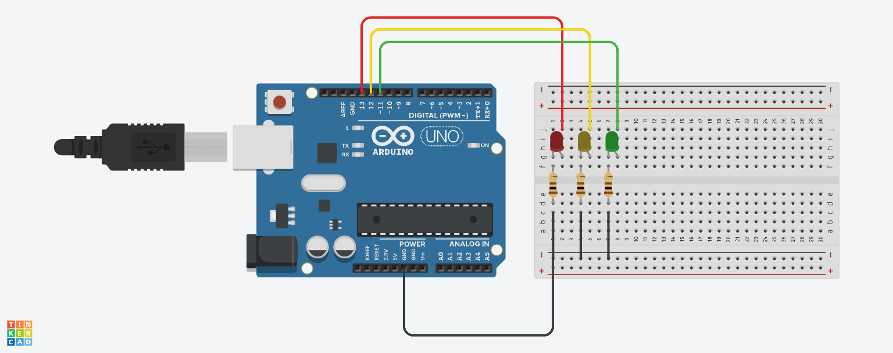

# Отчет №1
## Илья Герасимов
### Группа 8310

[Ссылка на проект 3.1](https://www.tinkercad.com/things/4DQcLbs9mjk-neat-allis/editel?tenant=circuits)


## Листинг программы 3.1
```C++
int LED1 = 13, LED2 = 12, i;
void setup()
{
  pinMode(LED1, OUTPUT);
  pinMode(LED2, OUTPUT);
}

void loop()
{
  for(i = 0; i < 4; i++)
  {
    delay(100);
    digitalWrite(LED2, HIGH);
    delay(550);
    digitalWrite(LED2, LOW);
    delay(550);
  }
  
  delay(1000);
  
  for(i = 0; i < 6; i++)
  {
    delay(100);
    digitalWrite(LED1, HIGH);
    delay(500);
    digitalWrite(LED1, LOW);
    delay(500);
  }
  delay(1000);
}
```

[Ссылка на проект 3.2](https://www.tinkercad.com/things/2bs7xTlprNU-grand-elzing-snaget/editel?tenant=circuits)


## Листинг программы 3.2
```C++
int LED1 = 13, LED2 = 12, i;
void setup()
{
  pinMode(LED1, OUTPUT);
  pinMode(LED2, OUTPUT);
}

void loop()
{
  digitalWrite(LED1, HIGH);
  
  for(i = 0; i < 10; i++)
  {
    digitalWrite(LED2, HIGH);
    delay(500);
    digitalWrite(LED2, LOW);
    delay(500);
  }
  delay(4000);
}
```

[Ссылка на проект 4](https://www.tinkercad.com/things/8xafI307Ltu-smooth-jaiks/editel?tenant=circuits)


## Листинг программы 4
```C++
int LED1 = 13, LED2 = 12, LED3 = 11, i;
void setup()
{
  pinMode(LED1, OUTPUT);
  pinMode(LED2, OUTPUT);
  pinMode(LED3, OUTPUT);
}

void loop()
{
  digitalWrite(LED1, HIGH);
  delay(2000);
  digitalWrite(LED2, HIGH);
  delay(1000);
  
  digitalWrite(LED1, LOW);
  digitalWrite(LED2, LOW);
  
  delay(200);
  
  digitalWrite(LED3, HIGH);
  delay(3000);
  digitalWrite(LED3, LOW);
}
```