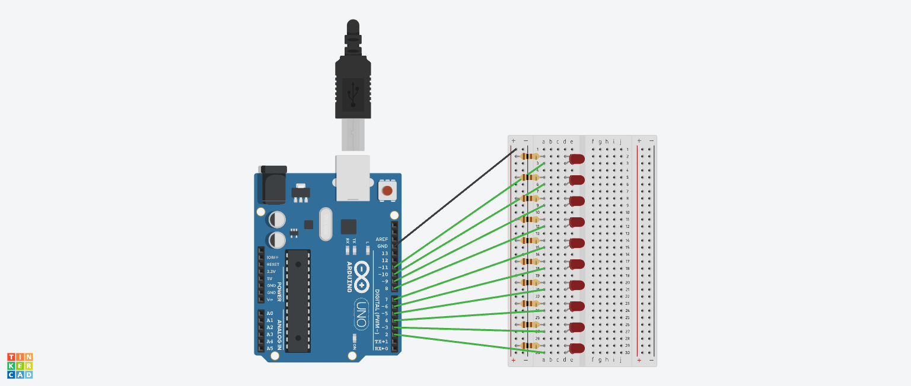
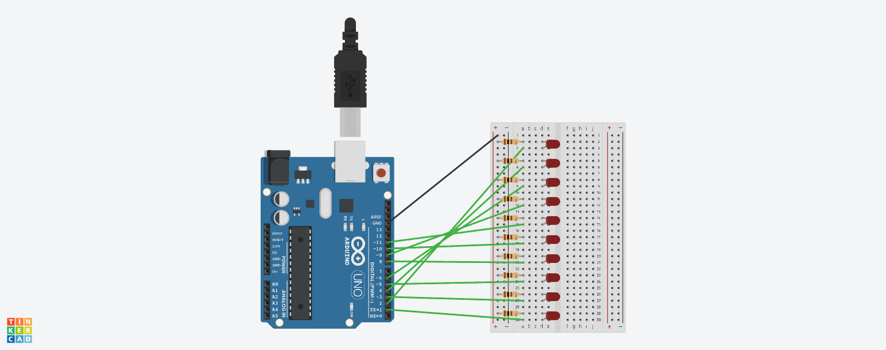

# Отчет №2
## Илья Герасимов
### Группа 8310

[Ссылка на проект 4.1](https://www.tinkercad.com/things/3vhiYTXFTp1)


## Листинг программы 4.1
```C++
byte i;
byte LedMin = 2;
byte LedMax = 11;
void setup()
{
  for (i = LedMin; i < LedMax; i++)
  {
    pinMode(i, OUTPUT);
  }
}
void loop()
{
  for (i = LedMin; i <= LedMax; i++)
  {
    digitalWrite(i, HIGH);
    delay(500);
  }
  for(i = LedMax; i >= LedMin; i--)
  {
    digitalWrite(i, LOW);
    delay(500);
  }
}
```

[Ссылка на проект 3.2](https://www.tinkercad.com/things/k8tjRHI9PCS)


## Листинг программы 4.2
```C++
byte i;
byte LedMin = 2;
byte LedMax = 11;
void setup()
{
  for (i = LedMin; i < LedMax; i++)
  {
    pinMode(i, OUTPUT);
  }
}
void loop()
{
  for (i = LedMin; i <= LedMax; i = i+2)
  {
    digitalWrite(i, HIGH);
    delay(500);
  }
  for(i = LedMax; i >= LedMin; i--)
  {
    digitalWrite(i, LOW);
    delay(500);
  }
}
```

[Ссылка на проект 4.3](https://www.tinkercad.com/things/lFchsZXNepG-copy-of-copy-of-brave-inari/editel?tenant=circuits)


## Листинг программы 4.3
```C++
byte i;
byte LedMin = 1;
byte LedMax = 11;
void setup()
{
  for (i = LedMin; i < LedMax; i++)
  {
    pinMode(i, OUTPUT);
  }
}
void loop()
{
  for (i = LedMin; i <= LedMax; i++)
  {
    digitalWrite(i, HIGH);
    delay(500);
  }
  for(i = LedMax; i >= LedMin; i--)
  {
    digitalWrite(i, LOW);
    delay(500);
  }
}
```