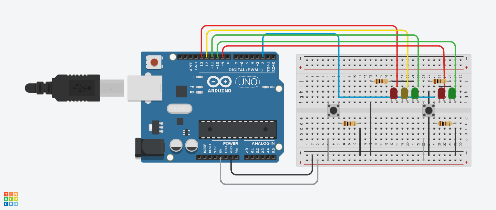
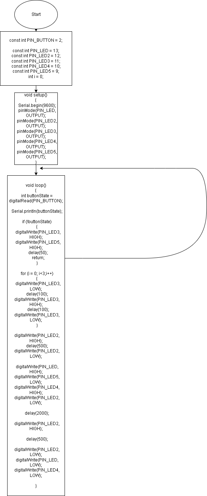

# Отчет №4
## Илья Герасимов
### Группа 8310

[Ссылка на проект 4.1](https://www.tinkercad.com/things/2iqtP3KJYYZ)


## Листинг программы 4
```C++
const int PIN_BUTTON = 2;

const int PIN_LED = 13;
const int PIN_LED2 = 12;
const int PIN_LED3 = 11;
const int PIN_LED4 = 10;
const int PIN_LED5 = 9;
int i = 0;
void setup()
{
  Serial.begin(9600);
  pinMode(PIN_LED, OUTPUT);
  pinMode(PIN_LED2, OUTPUT);
  pinMode(PIN_LED3, OUTPUT);
  pinMode(PIN_LED4, OUTPUT);
  pinMode(PIN_LED5, OUTPUT);
}
void loop()
{
  int buttonState = digitalRead(PIN_BUTTON);
  
  Serial.println(buttonState);
  
  if (!buttonState)
  {
    digitalWrite(PIN_LED3, HIGH);
    digitalWrite(PIN_LED5, HIGH);
    delay(50);
    return;
  }
  
  for (i = 0; i<3;i++)
  {
    digitalWrite(PIN_LED3, LOW);
  	delay(100);
  	digitalWrite(PIN_LED3, HIGH);
    delay(100);
  	digitalWrite(PIN_LED3, LOW);
  }
  
  digitalWrite(PIN_LED2, HIGH);
  delay(500);
  digitalWrite(PIN_LED2, LOW);
  
  digitalWrite(PIN_LED, HIGH);
  digitalWrite(PIN_LED5, LOW);
  digitalWrite(PIN_LED4, HIGH);
  digitalWrite(PIN_LED2, LOW);
  
  delay(2000);
  
  digitalWrite(PIN_LED2, HIGH);
  
  delay(500);
  
  digitalWrite(PIN_LED2, LOW);
  digitalWrite(PIN_LED, LOW);
  digitalWrite(PIN_LED4, LOW);

}
```
## Блок схема
