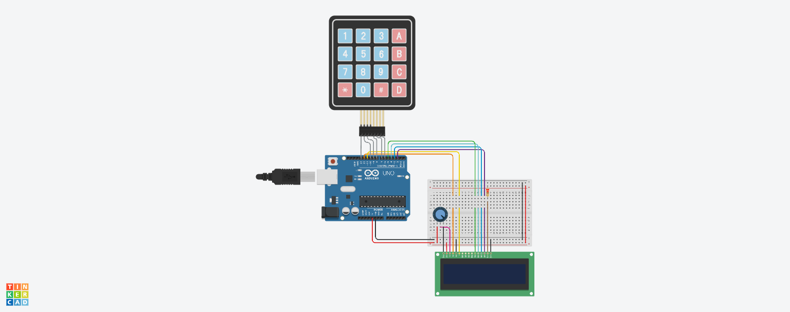

# Отчет №8
## Илья Герасимов
### Группа 8310

[Ссылка на проект 8](https://www.tinkercad.com/things/bnAOrAFhfUI)


## Листинг программы 8
```C++
#include<LiquidCrystal.h> 
#include<Keypad.h>  
 
int a; 
LiquidCrystal lcd(12, 11, 5, 4, 3, 2); 
 
const byte ROWS = 3;  
const byte COLS = 3;  
char hexaKeys[ROWS][COLS] =  { 
{'1','2','3',},  
{'4','5','6',}, 
{'7','8','9',}, 
}; 

byte rowPins[ROWS] = {13, 10, 9 };  
byte colPins[COLS] = {8, 7, 6 };  
 
Keypad customKeypad = Keypad( makeKeymap(hexaKeys), rowPins, colPins, ROWS, COLS);  
 
void setup()
{ 
   
  lcd.begin(16, 2);  
} 
 
void loop()
{ 
  char customKey = customKeypad.getKey();  
   
  if (customKey == '1')
  {
    a=1;
    lcd.clear(); 
    lcd.setCursor(0, 0); 
  	lcd.print(a);
  }
  
  if (customKey == '2')
  {
    a=2;
    lcd.clear(); 
    lcd.setCursor(0, 0); 
  	lcd.print(a);
  }
  
  if (customKey == '3')
  {
    a=3;
    lcd.clear(); 
    lcd.setCursor(0, 0); 
  	lcd.print(a);
  }
  
  if (customKey == '4')
  {
    a=4;
    lcd.clear(); 
    lcd.setCursor(0, 0); 
  	lcd.print(a);
  }
  
  if (customKey == '5')
  {
    a=5;
    lcd.clear(); 
    lcd.setCursor(0, 0); 
  	lcd.print(a);
  }
  
  if (customKey == '6')
  {
    a=6;
    lcd.clear(); 
    lcd.setCursor(0, 0); 
  	lcd.print(a);
  }
  
  if (customKey == '7')
  {
    a=7;
    lcd.clear(); 
    lcd.setCursor(0, 0); 
  	lcd.print(a);
  }
  
  if (customKey == '8')
  {
    a=8;
    lcd.clear(); 
    lcd.setCursor(0, 0); 
  	lcd.print(a);
  }
  
  if (customKey == '9')
  {
    a=9;
    lcd.clear(); 
    lcd.setCursor(0, 0); 
  	lcd.print(a);
  }
  
  if ((a%2 == 0) && ((a == 1) || (a == 2) || (a == 3) || (a == 4) || (a == 5) || (a == 6) || (a == 7) || (a == 8) || (a == 9))) 
  { 
  	lcd.setCursor(0, 1); 
    lcd.print("Chetnoe"); 
  }
  if (a%2 == 1) 
  { 
  	lcd.setCursor(0, 1); 
    lcd.print("Ne chetnoe");    
  } 
}
```