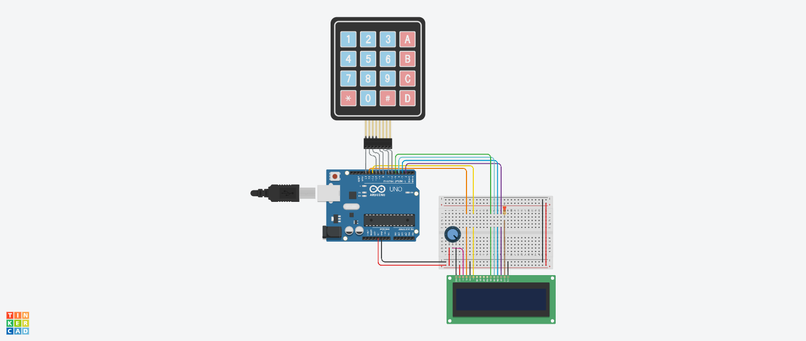

# Отчет №9
## Илья Герасимов
### Группа 8310

[Ссылка на проект 9](https://www.tinkercad.com/things/0B6YMWxa8bG)


## Листинг программы 9
```C++
#include<LiquidCrystal.h> 
#include<Keypad.h>  

const int Keys = 4;
int a, b;
char rightPass[Keys] = {'1', '2', '4', '6'};
char pressedkeys[Keys];
LiquidCrystal lcd(12, 11, 5, 4, 3, 2); 
 
const byte ROWS = 3;  
const byte COLS = 3;  
char hexaKeys[ROWS][COLS] =  { 
{'1','2','3',},  
{'4','5','6',}, 
{'7','8','9',}, 
}; 

byte rowPins[ROWS] = {13, 10, 9 };  
byte colPins[COLS] = {8, 7, 6 };  
 
Keypad customKeypad = Keypad( makeKeymap(hexaKeys), rowPins, colPins, ROWS, COLS);  
 
void setup()
{ 
   
  lcd.begin(16, 2);
  lcd.print("Enter pass");
} 
 
void loop()
{ 
  char customKey = customKeypad.getKey();  
   
  if (customKey != NO_KEY)
  {
    pressedkeys[a] = customKey;
    a = a + 1;
    if (a == Keys)
    {
      for (int i = 0; i < Keys; i++)
      {
        if (pressedkeys[i] == rightPass[i])
        {
          b++;
        }
      }
    }
  }
  if (b == Keys)
  {
    lcd.clear();
    lcd.setCursor(0, 1);
    lcd.print("Pass correct");
  }
  if (b != Keys && a == Keys)
  {
    lcd.clear();
    lcd.setCursor(0, 1);
    lcd.print("Pass incorrect");
  }
}
```